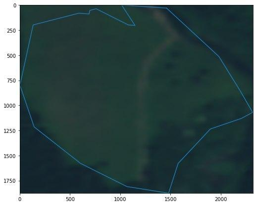
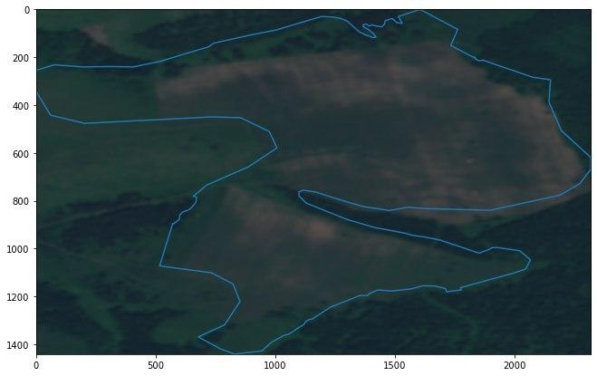

## Система мониторинга состояния земель сельскохозяйственного назначения

 

Система предназначена для экспертов ведомств, оценивающих состояние земель, при помощи статистической обработки спутниковых изображений.

Использование нашей технологии позволит автоматизировать принятие решений по обнаружению нарушений земельного законодательства.

Для получения информации мы используем Sentinel и обрабатываем данные с помощью Python, для дальнейшего отображения информации на сайте.

### [Алгоритм кластеризации и поиска аномалий](Leaders_of_digital.pdf)
### [Получение данных и получение подмаски sentinel](FieldsCV.ipynb)
### [Алгоритм кластеризации и поиска аномалий](proofs.ipynb)
### [Веб-сайт](digital_breakthrough)
